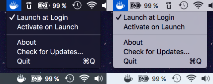

# Espresso #

Espresso is a _[Caffeine](http://lightheadsw.com/caffeine/)_ alternative with support for retina displays and the black respectively white menu bar introduced in OS X Yosemite.

## So what exactly is Espresso now? ##

Espresso is a small menu bar utility, that prevents your Mac from sleeping. Imagine watching a movie and your Mac keeps falling asleep over and over again. With Espresso you simply click on the little coffee cup in your menu bar and your Mac will stay awake with you. All night long - or at least until you click that coffee cup again to turn Espresso off.

## How does this work? ##

Espresso simply spawns a small system process called [caffeinate](https://developer.apple.com/library/mac/documentation/Darwin/Reference/ManPages/man8/caffeinate.8.html). So, you could say, Espresso is nothing more than a _simple to use_ wrapper for an already existing command line tool.

## Why does this project exist? ##

Mainly because I like writing Swift apps but also because _[Caffeine](http://lightheadsw.com/caffeine/)_ hasn't been updated in a while and it doesn't support Yosemite's black menu bar option. And besides writing Swift code I also like the black menu bar.

## Installation ##

You have two options installing Espresso:

1. Download the latest [release](https://github.com/behoernchen/Iconizer/releases) and drop into your Applications folder.
2. Download the source code and it compile yourself.

### License ###

The MIT License (MIT)

Copyright (c) 2015 Raphael Hanneken

Permission is hereby granted, free of charge, to any person obtaining a copy of this software and associated documentation files (the "Software"), to deal in the Software without restriction, including without limitation the rights to use, copy, modify, merge, publish, distribute, sublicense, and/or sell copies of the Software, and to permit persons to whom the Software is furnished to do so, subject to the following conditions:

The above copyright notice and this permission notice shall be included in all copies or substantial portions of the Software.

THE SOFTWARE IS PROVIDED "AS IS", WITHOUT WARRANTY OF ANY KIND, EXPRESS OR IMPLIED, INCLUDING BUT NOT LIMITED TO THE WARRANTIES OF MERCHANTABILITY, FITNESS FOR A PARTICULAR PURPOSE AND NONINFRINGEMENT. IN NO EVENT SHALL THE AUTHORS OR COPYRIGHT HOLDERS BE LIABLE FOR ANY CLAIM, DAMAGES OR OTHER LIABILITY, WHETHER IN AN ACTION OF CONTRACT, TORT OR OTHERWISE, ARISING FROM, OUT OF OR IN CONNECTION WITH THE SOFTWARE OR THE USE OR OTHER DEALINGS IN THE SOFTWARE.
